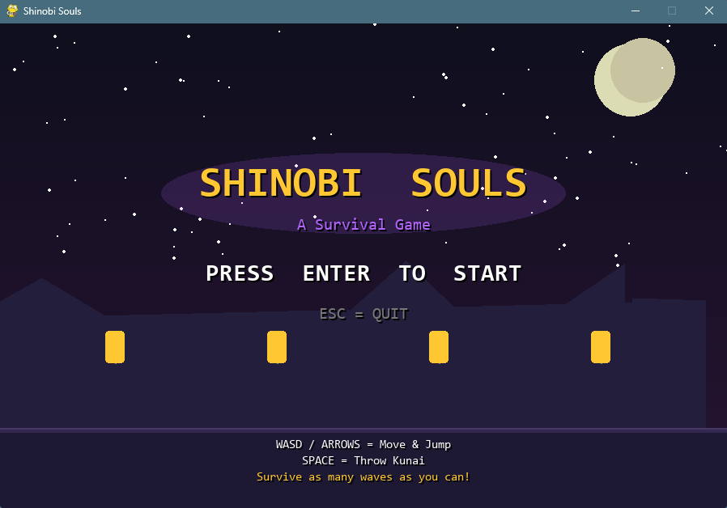
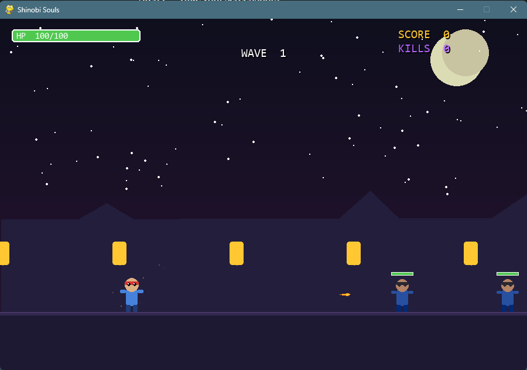
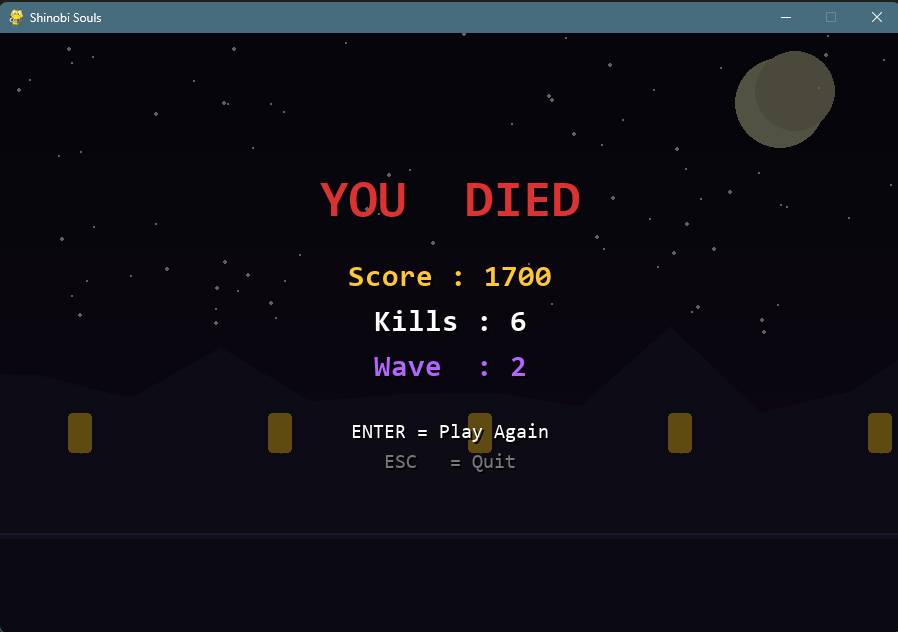

# Shinobi Souls — README

---

## 1. Which package/library does this program demonstrate?

This program uses **Pygame** (specifically `pygame` and `pygame.mixer`), a popular Python library for building 2D games and multimedia applications. The full overview of Pygame is covered in `OVERVIEW.md`.

---

## 2. How do you run the program?

### Requirements

- Python 3.8 or higher
- Pygame library

### Installation

First, install Pygame using pip:

```bash
pip install pygame
```

### Running the game

Navigate to the folder where `shinobi_souls.py` is saved and run:

```bash
python shinobi_souls.py
```

> **Note:** No extra assets or files are needed. Everything is drawn programmatically using Pygame's drawing functions.

---

## 3. What purpose does the program serve?

**Shinobi Souls** is a fully playable anime-themed 2D survival game. The point of the game is to survive as many waves of enemies as possible while racking up a high score.

The game serves as a real, working example of what Pygame can do and it's not just a "hello world" tech demo. It includes:

- A **main menu** and **game over screen** with replay support
- **Wave-based enemy spawning** that gets harder over time
- Three **enemy types**: Demon, Mage, and Samurai — each with unique look and behaviour (Mages shoot projectiles at the player)
- A **particle system** for visual effects on hits, kills, and attacks
- A **parallax scrolling background** with a night sky, mountains, moon and lanterns
- Player and enemy **HP bars**, a **score system** and **kill counter**
- A **brief invincibility window** after taking damage (so the game feels fair)

The game has genuine replayability because the wave difficulty scales up more enemies spawn faster each wave, and they have more HP.

---

## 4. Sample Input / Output

### Controls

| Key | Action |
|-----|--------|
| `W` or `↑` | Jump |
| `A` or `←` | Move Left |
| `D` or `→` | Move Right |
| `SPACE` | Throw Kunai |
| `ENTER` | Confirm (menus) |
| `ESC` | Quit |

### Example Gameplay Session

**Input:** Player presses `→` to move right, `SPACE` to fire a kunai at a Demon enemy.

**Output:** The kunai projectile travels across the screen, hits the demon, a burst of gold particles appears, the demon's HP bar decreases. If the demon reaches 0 HP:

```
Enemy killed!
Score: +200  (100 base × Wave 2)
Kill Count: 3
```

**When wave is cleared:**

```
Wave 3 starts!
Enemies this wave: 11
Wave clear bonus: +1500 points
```

**When player HP reaches 0:**

```
YOU DIED
Score : 4200
Kills : 17
Wave  : 5

ENTER = Play Again
ESC   = Quit
```

### Screenshots

> *Since this is a programmatic game, all visuals are generated at runtime. Below is a description of what each screen looks like:*

**Main Menu:**


**In-Game:**


**Game Over:**

